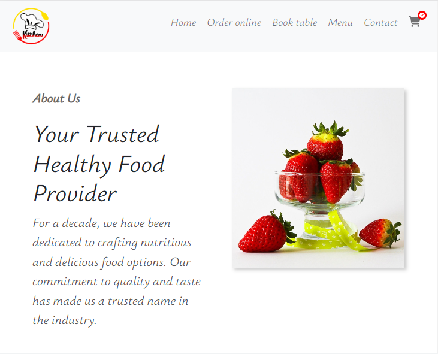
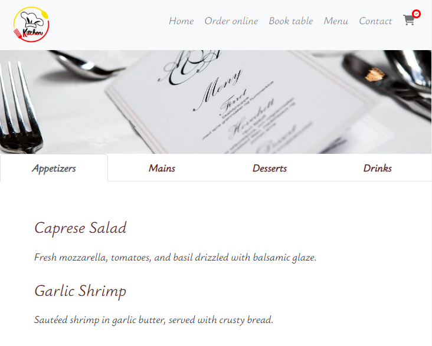
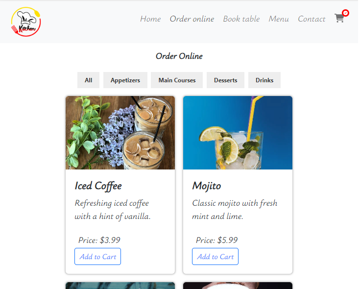
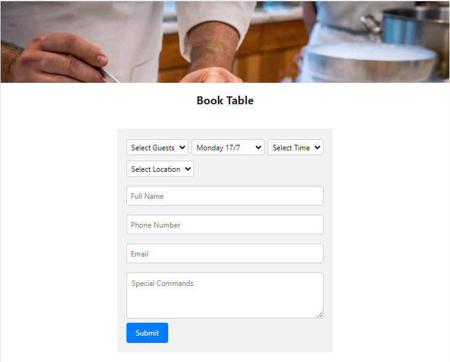
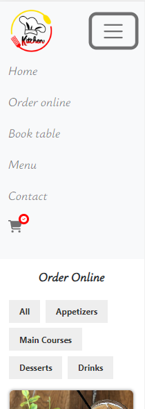
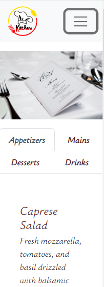
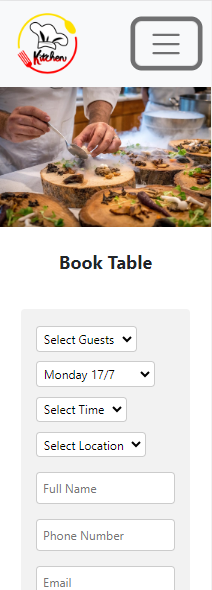

# Restaurant Front-End

Welcome to Restaurant Front-End repository! This project contains the front-end code for Restaurant website.

| Home Page \ Online order      | Menu Page \ Table reservation      |  
| --------------- | --------------- | 
|  |  
|  |  

## Features:

 The front-end code provides various features to enhance the user experience. These may include a responsive design that adapts to different screen sizes, a visually appealing layout with images and content, interactive elements like menus and forms, and smooth navigation between different pages.

### responsive design

| example 1    | example 2      |  example 3     |  
| --------------- | --------------- | --------------- | 
|  |  |  

## Getting Started

To get started with the project, follow these instructions:

1. Clone the repository:
   ```shell
   git clone https://github.com/lior92/lior-restaurant-front.git
2. Navigate to the project directory
   ```shell
   cd restaurant-front
3. Install the dependencies
   ```shell
   npm install
4. Start the development server:
   ```shell 
   npm start
 
 
The `src` directory contains all the source code for the application. The `components` directory contains reusable UI components, such as the header and footer. The `pages` directory contains the main page components, such as the Home and Menu pages. The `styles` directory contains the CSS styles for the application.

## Technologies Used

This project utilizes the following technologies:

- React: JavaScript library for building user interfaces.
- React Router: Library for routing in a React application.
- React Bootstrap: UI library specifically designed for React applications.

## Back-End Project

The back-end project for the Restaurant website can be found in the following repository: [Restaurant Backend](https://github.com/lior92/restaurant-back-end)

## Deployment

The Restaurant Front-End project has been deployed and is available at the following live site: [Restaurant Live Site](https://lior92-restaurant.surge.sh/order_online)


## Contributing

Contributions are welcome! If you find any issues or have suggestions for improvements, please open an issue or submit a pull request.

